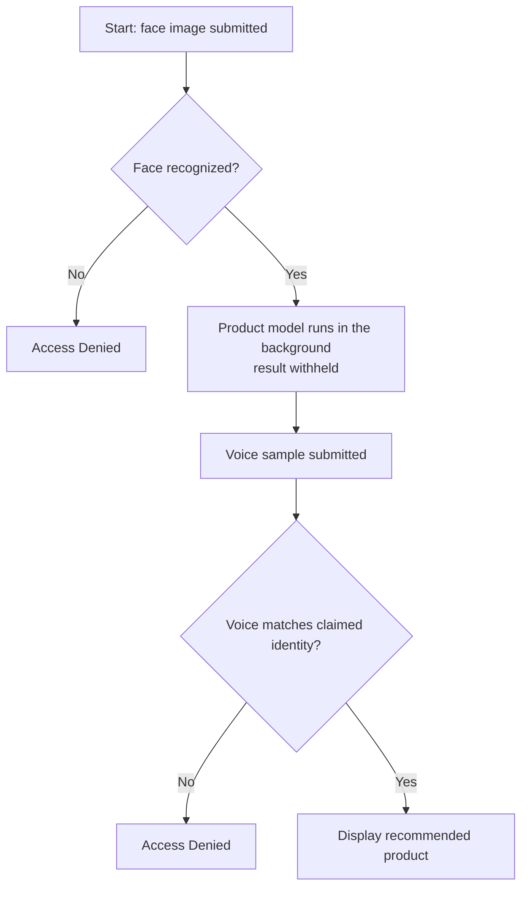

# Multimodal Data Preprocessing: User Identity & Product Recommendation System

A multimodal authentication and recommendation pipeline that gates a personalized product
prediction behind two biometric checks: a face match and a voice match. Built for the ALU
Formative 2 assignment by a four-person team, each owning one stage of the pipeline.

## System flow

A user is only shown a product recommendation after passing both biometric checks, in order:



Face is the cheap first filter; voice is a second factor from a different modality, so a
stolen photo alone can't pass the system. The product prediction is computed as soon as the
face is recognized but is never shown to the user until voice verification also succeeds.

## Repository layout

```
formative2-multimodal-preprocessing/
├── app/
│   ├── cli_app.py               # 4-stage state machine: face -> product -> voice -> display
│   └── simulate_scenarios.py    # Runs the required demo scenarios end to end
├── data/
│   ├── raw/                     # Source datasets, raw audio (data/raw/audio/<member>/),
│   │                             raw images (data/raw/images/<member>/)
│   ├── processed/                # Engineered CSVs, trained model artifacts (.pkl/.json), plots
│   └── demo/                    # Unauthorized face/voice samples used by the simulation
├── docs/
│   ├── report.md                 # Full system report (approach, per-task writeups, results)
│   ├── feature_definitions.md    # Data dictionary for merged_dataset.csv
│   ├── audio_instructions.md     # How to add/regenerate audio data
│   ├── image_instructions.md     # How to add/regenerate image data
│   └── evaluation_plan.md        # How each model is evaluated and compared
├── notebooks/
│   ├── Task1_Data_Merge_Feature_Engineering.ipynb
│   ├── Task2_Image_Pipeline_Divine.ipynb
│   ├── Task3_Audio_Pipeline_HonourGod.ipynb
│   └── Task4_Model_Integration_Simulation_Gaju.ipynb
├── scripts/                      # Reusable pipeline modules (imported by the notebooks and the app)
│   ├── data_preprocessing.py         # Task 1: merge + feature engineering
│   ├── image_preprocessing.py        # Task 2: face detection, augmentation, feature extraction
│   ├── facial_recognition_model.py   # Task 2: trains/serves the face recognition model
│   ├── audio_preprocessing.py        # Task 3: waveform/spectrogram, augmentation, feature extraction
│   ├── voice_verification_model.py   # Task 3: trains/serves the voiceprint verification model
│   └── product_recommendation_model.py # Task 4: trains/serves the product recommendation model
├── tests/                        # Unit tests for the preprocessing pipelines
└── requirements.txt
```

## Setup

Developed and tested on Python 3.13.

```bash
cd formative2-multimodal-preprocessing
pip install -r requirements.txt
```

## Datasets

- `data/raw/customer_social_profiles.xlsx`, `data/raw/customer_transactions.xlsx`: the two
  source tables merged in Task 1.
- `data/raw/images/<member>/`: 3 facial expressions per team member (neutral, smile, surprised).
- `data/raw/audio/<member>/`: 2 spoken phrases per team member ("Yes, approve", "Confirm
  transaction").
- `data/demo/`: synthetic unauthorized face/voice samples used only by the system simulation.

## Running the pipeline

Each stage can be run standalone (outputs land in `data/processed/`), or explored
interactively in its matching notebook under `notebooks/`.

```bash
# Task 1: merge customer_social_profiles + customer_transactions -> merged_dataset.csv
python scripts/data_preprocessing.py

# Task 2: face detection, augmentation, feature extraction -> image_features.csv
python scripts/image_preprocessing.py
python scripts/facial_recognition_model.py      # trains the facial recognition model

# Task 3: waveform/spectrogram, augmentation, feature extraction -> audio_features.csv
python scripts/audio_preprocessing.py
python scripts/voice_verification_model.py      # trains the voiceprint verification model

# Task 4: product recommendation model, trained on merged_dataset.csv
python scripts/product_recommendation_model.py
```

### Running the system

```bash
# Interactive CLI: prompts for an image path, customer_id, and audio path
python -m app.cli_app

# Scripted demo: runs the three required scenarios (unauthorized image, unauthorized
# voice, and a full successful transaction) and prints a pass/fail summary
python -m app.simulate_scenarios
```

### Tests

```bash
python -m unittest discover -s tests
```

## Models

All three models compare 2–3 candidate algorithms (Logistic Regression, Random Forest, and
Gradient Boosting where applicable) on a grouped train/test split, and keep the best by F1.
Full per-model reports are in `data/processed/*_model.json`; the methodology and results are
written up in detail in `docs/report.md`.

| Model | Task | Selected algorithm | Accuracy | F1 | Log loss |
|---|---|---|---|---|---|
| Facial recognition | Multiclass member classification, thresholded for unknown faces | Logistic Regression | 0.900 | 0.900 | 0.242 |
| Voiceprint verification | Genuine/impostor pair classification | Logistic Regression | 0.979 | 0.960 | 0.182 |
| Product recommendation | Multiclass category prediction | Logistic Regression | 0.500 | 0.435 | 2.375 |

The product model's lower score reflects the small size of the merged dataset (36 customers
after requiring both a social profile and ≥2 transactions); this is discussed in the report.

## Documentation

- [`docs/feature_definitions.md`](formative2-multimodal-preprocessing/docs/feature_definitions.md):
  data dictionary for `merged_dataset.csv`.
- [`docs/evaluation_plan.md`](formative2-multimodal-preprocessing/docs/evaluation_plan.md):
  how each model and the end-to-end system are evaluated.
- [`docs/audio_instructions.md`](formative2-multimodal-preprocessing/docs/audio_instructions.md) /
  [`docs/image_instructions.md`](formative2-multimodal-preprocessing/docs/image_instructions.md):
  how to add new recordings/photos and regenerate features.

## Team

| Member | Owns |
|---|---|
| Andrew | Data merge, cleaning, and feature engineering (`merged_dataset.csv`, `data_preprocessing.py`) |
| Divine | Image collection, preprocessing, augmentation, facial recognition model |
| HonourGod | Audio collection, preprocessing, augmentation, voiceprint verification model |
| Gaju | Product recommendation model, CLI integration, system simulation, report assembly |
